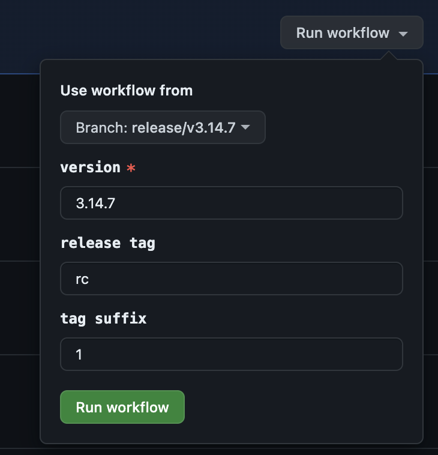

# Release Steps

## Step 0 - Setup
1. Create a new branch for the release: `git checkout -b release/v{X.X.X}`
2. Write/Generate changelog in `CHANGELOG.md` and bump the package version in `package.json`.
3. Commit all changes and push to remote.
4. Comment `/bot create ticket` on the GitHub PR to make a release ticket automatically.
5. Once the release ticket is created successfully, ask the EM to review the release ticket and await `Release approved`.

## Step 1 - Trigger GitHub Actions Workflow
1. Go to the GitHub repository and navigate to the Actions tab.
2. Select the **"Package build and publish"** workflow.
3. Provide the required inputs:
   
   - **version**: Enter the new version (e.g., `X.X.X`).
   - **npm_tag**: Enter the release tag if applicable (e.g., `beta`, `next`, `rc`), otherwise leave it blank for the actual release.
   - **tag_suffix**: Enter the tag suffix if applicable, otherwise leave it blank. If provided, the npm release tag format will be `${version}-${npm_tag}-${tag_suffix}`; e.g., `1.2.3-rc-0`.
4. Click on "Run workflow". The workflow will cover these steps:
   - Publish the package to npm.
   - Tag the new version and push it to the origin.

## Step 2 - Post-Release
1. In the GitHub repository, navigate to the [releases](https://github.com/sendbird/sendbird-uikit-react/releases) section.
2. Draft a new release note with the new tag automatically created in Step 1 by the workflow. Write the changelog in the description and then publish the release.
3. In the `sdk-release` channel, post a release message.

